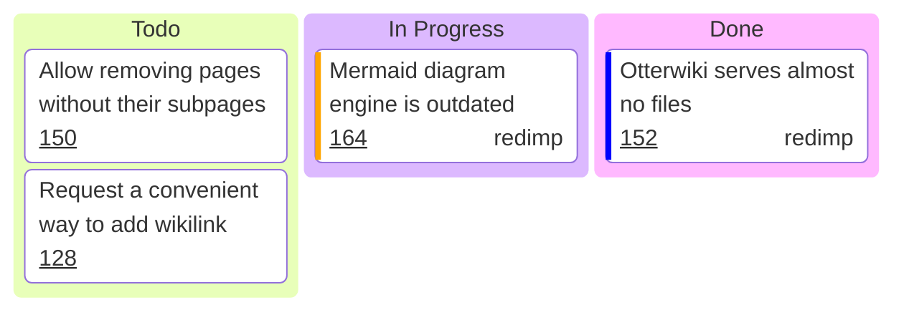
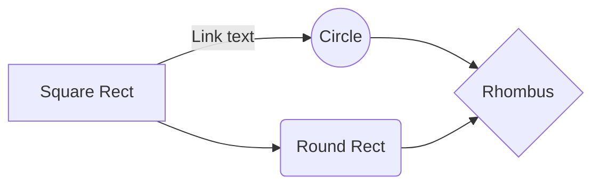
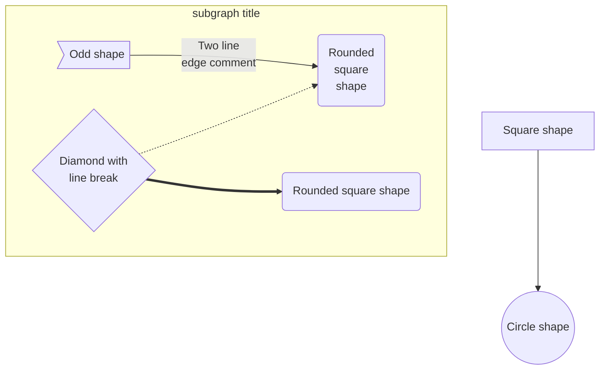
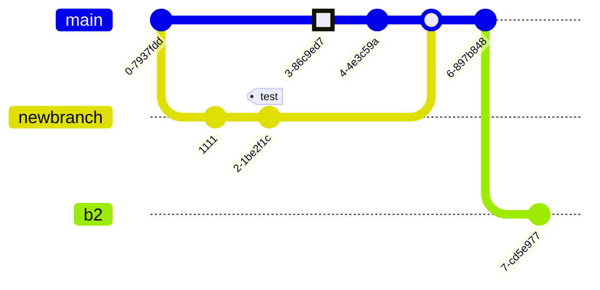
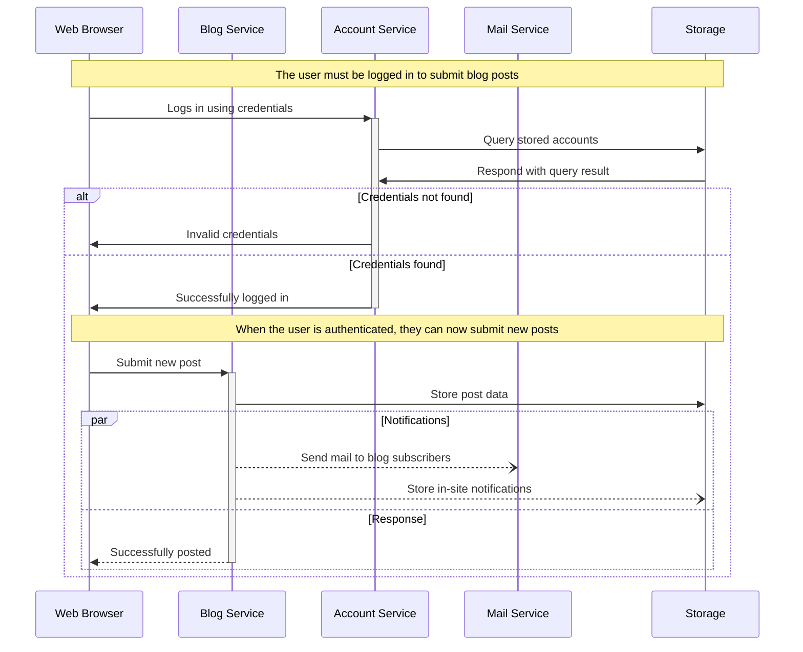

# Mermaid

## Kanban

```mermaid
---
config:
  kanban:
    ticketBaseUrl: 'https://github.com/redimp/otterwiki/issues/#TICKET#'
---
kanban
  todo[Todo]
      id150[Allow removing pages without their subpages]@{ ticket: '150' }
      id128[Request a convenient way to add wikilink]@{ ticket: '128' }
  inprogress[In Progress]
      id164[Mermaid diagram engine is outdated]@{ ticket: '164', assigned: 'redimp', priority: 'High' }
  done[Done]
      id152[Otterwiki serves almost no files]@{ ticket: '152', assigned: 'redimp', priority: 'Low' }
```

## Graph

```mermaid
graph LR
    A[Square Rect] -- Link text --> B((Circle))
    A --> C(Round Rect)
    B --> D{Rhombus}
    C --> D
```

## Subgraph

```mermaid
graph TB
    sq[Square shape] --> ci((Circle shape))

    subgraph A["subgraph title"]
        od>Odd shape]-- Two line\nedge comment --> ro
        di{Diamond with \n line break} -.-> ro(Rounded<br>square<br>shape)
        di==>ro2(Rounded square shape)
    end
```

## Git Graph

```mermaid
gitGraph:
    commit "Ashish"
    branch newbranch
    checkout newbranch
    commit id:"1111"
    commit tag:"test"
    checkout main
    commit type: HIGHLIGHT
    commit
    merge newbranch
    commit
    branch b2
    commit
```

## Sequence Diagram

```mermaid
sequenceDiagram
    participant web as Web Browser
    participant blog as Blog Service
    participant account as Account Service
    participant mail as Mail Service
    participant db as Storage

    Note over web,db: The user must be logged in to submit blog posts
    web->>+account: Logs in using credentials
    account->>db: Query stored accounts
    db->>account: Respond with query result

    alt Credentials not found
        account->>web: Invalid credentials
    else Credentials found
        account->>-web: Successfully logged in

        Note over web,db: When the user is authenticated, they can now submit new posts
        web->>+blog: Submit new post
        blog->>db: Store post data

        par Notifications
            blog--)mail: Send mail to blog subscribers
            blog--)db: Store in-site notifications
        and Response
            blog-->>-web: Successfully posted
        end
    end
```
